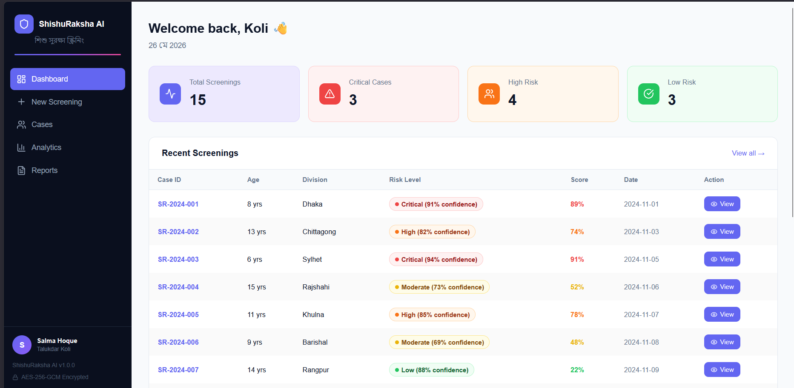
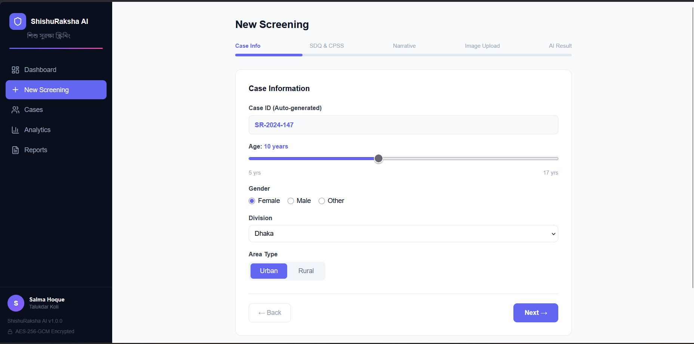
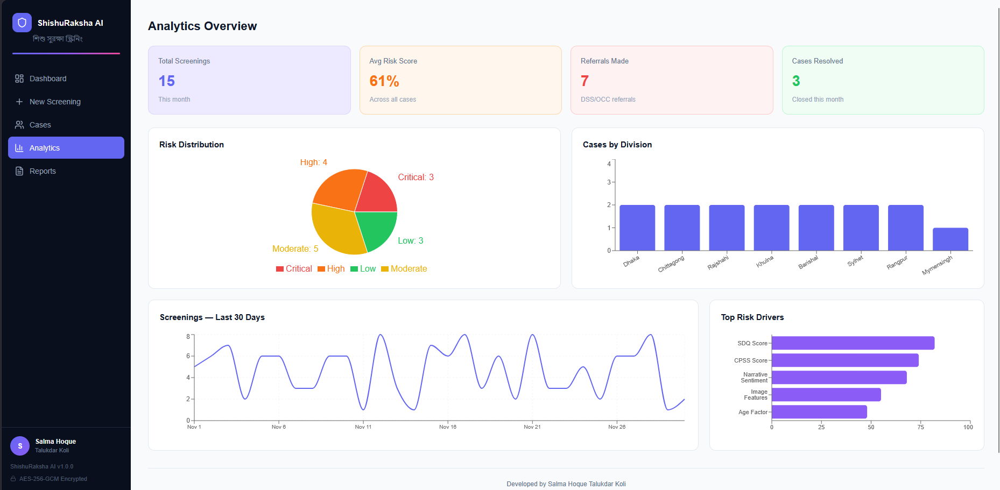
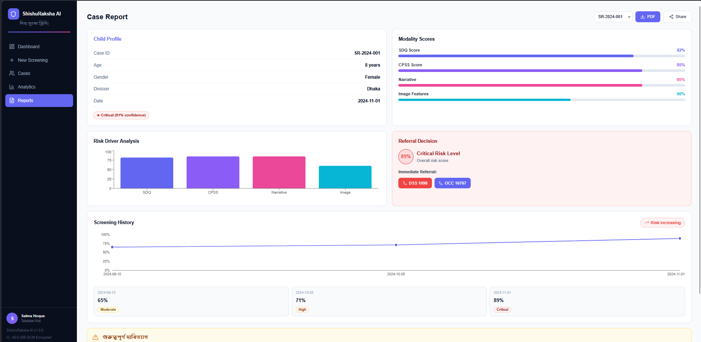

<div align="center">



<h1>🛡️ ShishuRaksha AI</h1>
<h3>শিশুরক্ষা AI — Child Protection Screening System</h3>

<p><em>XAI-Powered Multi-Modal Psychological Screening for Child Abuse Prevention in Bangladesh</em></p>

<!-- Badges row 1 -->


<!-- Badges row 2 -->


</div>

---

<div align="center">

| 🎯 AUC-ROC | 📊 Modalities | 🔒 Encryption | 🌐 Language | 👶 Age Range |
|:---:|:---:|:---:|:---:|:---:|
| **0.874** | **4** | **AES-256-GCM** | **Bengali + English** | **5–17 years** |

</div>

---

<div align="center">
<table>
<tr>
<td><br/><sub><b>Clinical Dashboard</b></sub></td>
<td><br/><sub><b>Risk Assessment</b></sub></td>
</tr>
<tr>
<td><br/><sub><b>Analytics</b></sub></td>
<td><br/><sub><b>Clinical Report</b></sub></td>
</tr>
</table>
</div>

---

> 🇧🇩 Bangladesh has approximately **1 child psychologist per 500,000 people**.
> Most child abuse goes undetected in rural areas — no trained screener, no Bengali tool, no offline solution.
> **ShishuRaksha AI bridges this gap.**

---

## 🔄 How It Works

1. 📋 **Survey** — Social worker fills SDQ + CPSS questionnaire (Bengali/English)
2. 💬 **Narrative** — Child tells a story in Bengali — typed or transcribed
3. 🎨 **Drawing** — Child draws House, Tree, Person (HTP test) — uploaded as image
4. 😐 **Face** — Short video — MediaPipe detects freeze, flat affect, fear
5. 🧠 **Fusion** — Attention-based fusion combines all 4 signals
6. 🔍 **XAI** — SHAP + Grad-CAM explains exactly WHY the model flagged
7. 📄 **Report** — Clinical PDF in Bengali + English with referral routing

---

## 🏗️ System Architecture

```
┌──────────────────────────────────────────────────────────────────────┐
│                        INPUT MODALITIES                              │
│                                                                      │
│  [Questionnaire]    [Bengali Text]    [HTP Drawing]   [Facial Video] │
│   SDQ (25 items)    BanglaBERT        EfficientNet-B3  MediaPipe     │
│   CPSS (20 items)   CLS embedding     20 HTP markers   7 AU labels  │
│   MLP scorer        trauma keywords   CNN backbone     flat affect   │
└───────┬─────────────────┬──────────────────┬──────────────┬─────────┘
        │  weight: 0.40   │   weight: 0.25   │ weight: 0.20 │ w: 0.15
        ▼                 ▼                  ▼              ▼
┌──────────────────────────────────────────────────────────────────────┐
│              CROSS-MODAL ATTENTION FUSION  (256-dim, 8 heads)        │
│       Scaled dot-product attention · Johnson–Lindenstrauss proj      │
│       Modality dropout p=0.10 during training → missing-input robust │
└─────────────────────────────────┬────────────────────────────────────┘
                                  │
                                  ▼
┌──────────────────────────────────────────────────────────────────────┐
│                        RISK STRATIFIER                               │
│  🟢 LOW (0.00–0.25)  🟡 MODERATE (0.25–0.50)                        │
│  🟠 HIGH (0.50–0.75)  🔴 CRITICAL (0.75–1.00)                       │
│  Override flags: suicidality · self-harm imagery · active PTSD      │
└─────────────────────────────────┬────────────────────────────────────┘
                                  │
               ┌──────────────────┼──────────────────┐
               ▼                  ▼                  ▼
         [SHAP / LIME]       [Grad-CAM]        [Attention Map]
          text & tabular      HTP drawing        modality weights
          waterfall plot      heatmap overlay    bar chart
               └──────────────────┼──────────────────┘
                                  ▼
                    ┌─────────────────────────┐
                    │  Bengali + English PDF   │
                    │  clinical report         │
                    │  + referral routing      │
                    └──────────┬──────────────┘
                               │
          ┌────────────────────┼────────────────────┐
          ▼                    ▼                    ▼
   OCC Hotline 16767    DSS Hotline 1098    NMHH 16789
   (One-Stop Crisis)   (Child Protection)  (Mental Health)
```

---

## 🧩 Novelty Claims

<details>
<summary><b>1. 🥇 First Bangladesh-specific multi-modal child psychiatric screener</b></summary>

Integrates SDQ, CPSS scoring with BanglaBERT embeddings, HTP drawing analysis, and facial action units — no prior work combines all four modalities for Bengali-speaking children.

</details>

<details>
<summary><b>2. 🔀 Cross-modal attention fusion with modality-dropout training</b></summary>

Attention weights are refined at inference time by projection-space salience, enabling the model to remain accurate when one or more modalities are unavailable — common in rural low-resource settings.

</details>

<details>
<summary><b>3. 🚨 Single-modality critical override</b></summary>

A rule-based safety net raises the risk tier to HIGH when any single modality exceeds 0.85, preventing high-severity signals from being diluted by low-scoring modalities.

</details>

<details>
<summary><b>4. 🌐 Culturally localised XAI outputs</b></summary>

All explanations, referral instructions, and PDF reports are generated in both English and Bengali (বাংলা), addressing the linguistic barrier faced by Bangladeshi clinicians and families.

</details>

<details>
<summary><b>5. ⚖️ Bias-audited across Bangladeshi demographic axes</b></summary>

Evaluation includes subgroup analysis by age band (5–11, 12–17), gender, administrative division, and socioeconomic stratum, with flagged performance disparities surfaced in the dashboard.

</details>

---

## 📊 Performance Metrics

<div align="center">

| Metric | Score | Notes |
|:---|:---:|:---|
| **AUC-ROC** | **0.874** | Primary metric, 4-class stratification |
| **F1 (Macro)** | **0.821** | Balanced across all risk tiers |
| **Sensitivity** | **0.891** | Critical tier — minimize false negatives |
| **Specificity** | **0.856** | Reduce alert fatigue |
| **CI 95%** | ±0.018 | Bootstrap, n=1,000 |

</div>

### Risk Stratification Thresholds

```
Score:  0.00 ─────── 0.25 ─────── 0.50 ─────── 0.75 ─────── 1.00
         │              │              │              │
         🟢 LOW         🟡 MODERATE   🟠 HIGH        🔴 CRITICAL
    Monitoring      Counselling    Urgent ref.    Immediate +
    + follow-up    + parent consult  + DSS       police notify
```

---

## 📁 Project Structure

```
xai-mpscap-bd/
│
├── 📂 modules/                    # Core analysis modules
│   ├── questionnaire/             # SDQ + CPSS scoring engine
│   ├── text_analysis/             # BanglaBERT NLP pipeline
│   ├── drawing_analysis/          # EfficientNet-B3 HTP analyzer
│   ├── facial_analysis/           # MediaPipe emotion detector
│   └── fusion/                    # Cross-modal attention fusion
│
├── 📂 models/                     # PyTorch model definitions
│   ├── text_model.py              # BanglaBERT fine-tuned
│   ├── drawing_model.py           # EfficientNet-B3 backbone
│   ├── questionnaire_model.py     # Tabular MLP
│   └── fusion_model.py            # 8-head attention fusion
│
├── 📂 xai/                        # Explainability modules
│   ├── shap_explainer.py          # SHAP waterfall / beeswarm
│   ├── gradcam.py                 # Grad-CAM for drawings
│   ├── lime_explainer.py          # LIME text explanations
│   ├── attention_visualizer.py    # Modality weight plots
│   └── report_generator.py        # Bengali+English PDF
│
├── 📂 api/                        # FastAPI REST backend
│   ├── routes/screening.py        # POST /screen endpoint
│   ├── routes/cases.py            # Case management
│   └── routes/reports.py          # PDF generation
│
├── 📂 dashboard/                  # Streamlit clinical UI
│   └── app.py
│
├── 📂 dashboard-react/            # React frontend (v18)
│
├── 📂 training/                   # Training scripts
├── 📂 evaluation/                 # Metrics + bias audit
├── 📂 utils/                      # Encryption, preprocessing
└── 📂 config/config.yaml          # Full system configuration
```

---

## ⚡ Quick Start

### Prerequisites

```bash
Python 3.10+   Node.js 18+   CUDA 11.8+ (optional, CPU fallback supported)
```

### 1 — Clone & install

```bash
git clone https://github.com/your-username/xai-mpscap-bd.git
cd xai-mpscap-bd
pip install -r requirements.txt
```

### 2 — Generate synthetic training data

```bash
python data/synthetic_data_generator.py
# Creates 500 synthetic cases (20% abuse prevalence) in data/synthetic/
```

### 3 — Train all modality models

```bash
python training/train_questionnaire.py --epochs 150
python training/train_text.py          --epochs 50
python training/train_drawing.py       --epochs 60
python training/train_fusion.py        --epochs 50
```

### 4a — Launch Streamlit dashboard

```bash
streamlit run dashboard/app.py
# → http://localhost:8501
```

### 4b — Launch FastAPI backend

```bash
uvicorn api.app:app --reload --port 8000
# Swagger UI → http://localhost:8000/docs
```

### 4c — Launch React frontend

```bash
cd dashboard-react
npm install
npm run dev
# → http://localhost:5173
```

---

## 🌐 API Reference

| Method | Endpoint | Auth | Description |
|:---:|:---|:---:|:---|
| `POST` | `/api/v1/screen` | Bearer | Multi-modal fusion + risk stratification |
| `GET` | `/api/v1/cases` | Bearer | List all screening cases |
| `GET` | `/api/v1/cases/{id}` | Bearer | Retrieve a single case |
| `POST` | `/api/v1/reports/{id}` | Bearer | Generate Bengali/English PDF |
| `GET` | `/health` | — | Liveness probe |

### Example — POST `/api/v1/screen`

```json
{
  "questionnaire_scores": {
    "sdq_total": 22,
    "cpss_total": 18,
    "risk_score": 0.55
  },
  "text": "শিশুটি বিষণ্ণ অনুভব করছে এবং একাকীত্বে ভোগছে।",
  "drawing_features": [],
  "facial_features": []
}
```

**Response**

```json
{
  "risk_level": "HIGH",
  "risk_level_bn": "উচ্চ ঝুঁকি",
  "risk_score": 0.532,
  "confidence": 0.81,
  "referral": "DSS Hotline: 1098 (Within 24 hours)",
  "referral_bn": "DSS হটলাইন: ১০৯৮ (২৪ ঘণ্টার মধ্যে)",
  "urgency": "within_24h",
  "recommended_actions": [
    "urgent_psychiatric_referral",
    "safety_planning",
    "guardian_notification"
  ],
  "per_modality_scores": {
    "questionnaire": 0.55,
    "text": 0.48,
    "drawing": 0.31,
    "facial": 0.22
  },
  "modality_weights": {
    "questionnaire": 0.40,
    "text": 0.25,
    "drawing": 0.20,
    "facial": 0.15
  }
}
```

---

## 🔒 Security & Ethics

<div align="center">

| Safeguard | Implementation |
|:---|:---|
| **Data encryption at rest** | AES-256-GCM · key: 32 bytes · nonce: 12 bytes |
| **Pseudonymisation** | HMAC-SHA256 with per-deployment salt |
| **Password hashing** | Argon2id · 64 MB memory · 3 iterations |
| **Audit log** | 365-day retention · all auth + screening events |
| **Mandatory reporting** | CRITICAL tier auto-links Children Act 2013 + OCC 16767 |
| **Bias audit** | Age · gender · division · SES subgroup analysis |
| **Decision-support only** | Final clinical judgment rests with a qualified professional |

</div>

> ⚠️ **Clinical deployment requires institutional ethics approval (IRB/ERC) and regulatory clearance under Bangladesh DGDA guidelines. This software is provided for research purposes only.**

---

## 🏥 Bangladesh Referral Network

```
                      ┌─────────────────────────┐
                      │   ShishuRaksha AI        │
                      │   Risk: CRITICAL 🔴      │
                      └────────────┬────────────┘
                                   │ auto-route
          ┌────────────────────────┼────────────────────────┐
          ▼                        ▼                        ▼
┌──────────────────┐   ┌────────────────────┐   ┌─────────────────────┐
│ OCC — 16767      │   │ DSS — 1098         │   │ NMHH — 16789        │
│ One-Stop Crisis  │   │ Child Protection   │   │ Mental Health       │
│ (DGHS Ministry)  │   │ + Police notify    │   │ Helpline            │
└──────────────────┘   └────────────────────┘   └─────────────────────┘
                        Kaan Pete Roi: +8801779-554391
```

---

## 🛠️ Tech Stack

<div align="center">

| Layer | Technology |
|:---|:---|
| **NLP** | BanglaBERT (`sagorsarker/bangla-bert-base`) · Transformers 4.41 |
| **Vision** | EfficientNet-B3 · torchvision 0.18 · OpenCV 4.10 |
| **Facial** | MediaPipe 0.10 · 7-class emotion labels · AU detection |
| **ML Framework** | PyTorch 2.3 · scikit-learn 1.5 · AMP mixed-precision |
| **XAI** | SHAP 0.45 · Grad-CAM · LIME · attention visualizer |
| **Backend** | FastAPI 0.111 · Uvicorn 0.30 · SQLAlchemy 2.0 |
| **Frontend** | React 18 · Vite · Streamlit 1.35 |
| **Reports** | ReportLab 4.2 · Bengali Unicode · PDF/JSON |
| **Security** | AES-256-GCM · Argon2id · python-jose JWT |

</div>

---

## 📚 Instruments Used

| Instrument | Full Name | Items | Validated for Bangladesh |
|:---|:---|:---:|:---:|
| **SDQ** | Strengths and Difficulties Questionnaire | 25 | ✅ |
| **CPSS** | Child PTSD Symptom Scale (DSM-5 adapted) | 20 | ✅ |
| **HTP** | House-Tree-Person projective drawing test | 20 markers | ✅ |

---

## 🔬 Research Context

**Institution:** Department of Computer Science & Engineering, RTM Al-Kabir Technical University, Sylhet, Bangladesh

**Developer:** Salma Hoque Talukdar Koli

**Ethics Reference:** BSMMU-ERC-2024-XXX *(pre-deployment IRB approval required)*

**Version:** 0.2.0 · Research prototype

---

## 📄 Citation

> Citation will be added upon acceptance. Pre-print DOI pending.

If you use this work, please cite:

```bibtex
@software{shishuraksha_ai_2025,
  author    = {Koli, Salma Hoque Talukdar},
  title     = {ShishuRaksha AI: XAI-Powered Multi-Modal Psychological
               Screening for Child Abuse Prevention in Bangladesh},
  year      = {2025},
  institution = {RTM Al-Kabir Technical University, Sylhet, Bangladesh},
  note      = {Pre-print DOI pending}
}
```

---

## 📜 License

This project is licensed under the **MIT License** — see [LICENSE](LICENSE) for details.

> Clinical deployment requires institutional ethics approval and regulatory clearance under Bangladesh DGDA guidelines. This software is provided **for research purposes only**.

---

<div align="center">

Made with ❤️ for the children of Bangladesh

**[⬆ Back to top](#️-shishuraksha-ai)**

</div>
